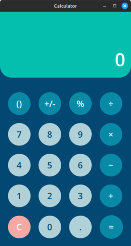
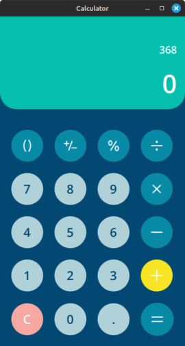
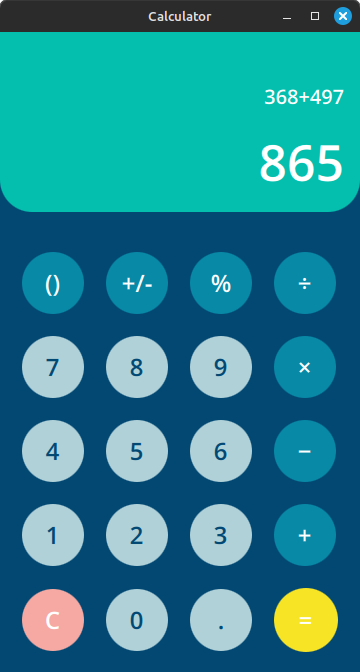
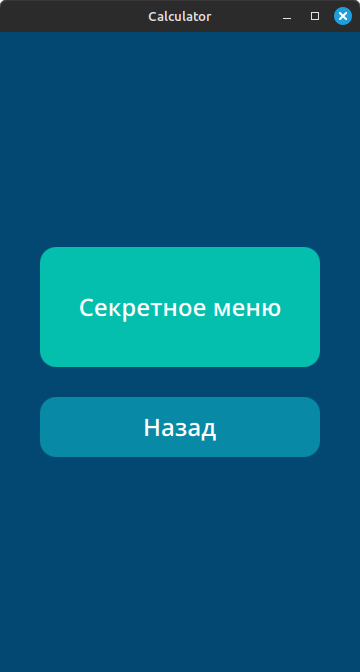
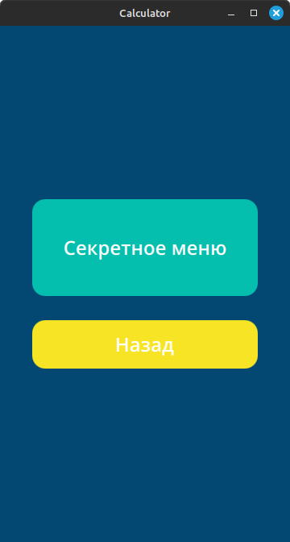

# Calculator (Qt/QML)

Калькулятор с поддержкой скобок и секретным режимом, реализованный на Qt Quick и C++17.

## ✨ Функциональность
- Векторные SVG-иконки
- Базовые операции: `+`, `−`, `×`, `÷`
- Скобки `()` с интеллектуальной логикой открытия/закрытия
- Смена знака (`+/-`) и проценты (`%`)
- Секретный режим: долгое нажатие (4 сек) на `=` → ввод `123` за 5 сек → переход во второе окно

## 🛠 Сборка
```bash
mkdir build && cd build
cmake ..
cmake --build .
./bin/calculator-qml
```

## 📦 Требования
- Qt 5.12+ (Core, Gui, Quick)
- CMake 3.16+
- Компилятор с поддержкой C++17

## 📸 Скриншоты

### Основной экран




### Секретное меню



## 📁 Структура
```
calculator-qml/
├── CMakeLists.txt          # Конфигурация сборки
├── main.cpp                # Точка входа
├── calculator.qrc          # Манифест ресурсов
├── main.qml                # Корневой компонент
├── Calculator.qml          # Основной экран калькулятора
├── SecretMenu.qml          # Секретное меню
├── README.md               # Документация
├── .gitignore              # Исключения для Git
├── assets/                 # Векторные иконки операций (из Figma)
│   ├── bkt.svg             # Скобки ()
│   ├── division.svg        # Деление ÷
│   ├── equal.svg           # Равно =
│   ├── minus.svg           # Вычитание −
│   ├── multiplication.svg  # Умножение ×
│   ├── percent.svg         # Процент %
│   ├── plus_minus.svg      # Смена знака +/-
│   └── plus.svg            # Сложение +
├── screenshots/            # Скриншоты интерфейса
│   ├── main1.png
│   ├── main2.png
│   ├── main3.png
│   ├── secret1.png
│   └── secret2.png
└── components/             # Переиспользуемые компоненты
    ├── KeypadButton.qml    # Стандартная кнопка
    └── LongPressButton.qml # Кнопка с долгим нажатием
```